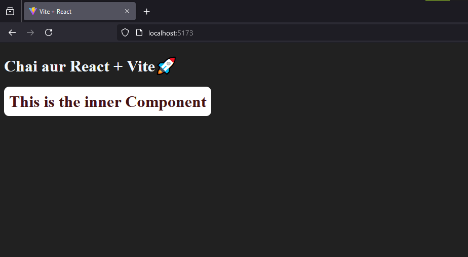

## main.jsx
``` jsx
import { StrictMode } from 'react'
import { createRoot } from 'react-dom/client'
import App from './App.jsx'

// Building a virtual DOM using the #root element
createRoot(document.getElementById('root')).render(
  // Lets you find common bugs in your components early during development
  <StrictMode>  
    <App />     {/* Component */}
  </StrictMode>,
)
```
## App.jsx
``` jsx
import Component from "./Component"

function App() {
  return (
    // Returning a div. is mandatory, since .jsx is wrapped in enclosing tags
    <>
    <h1>Chai aur React + Vite🚀</h1>
    <Component/>
    </>
  )
}
export default App
```
## Component.jsx
``` jsx
// Component to be defined in Upper-case in vite (.jsx files)
function Component(){
    return (
        <>
            <h1 style={{
                color:"#441212", 
                background:"#FFF", 
                borderRadius: "10px",
                padding: "10px",
                width: "max-content",
                }}>
                This is the inner Component</h1>
        </>
    )
}
export default Component    //  Remember to export the component
```
## Output
